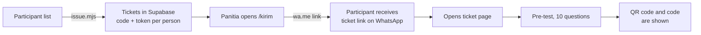
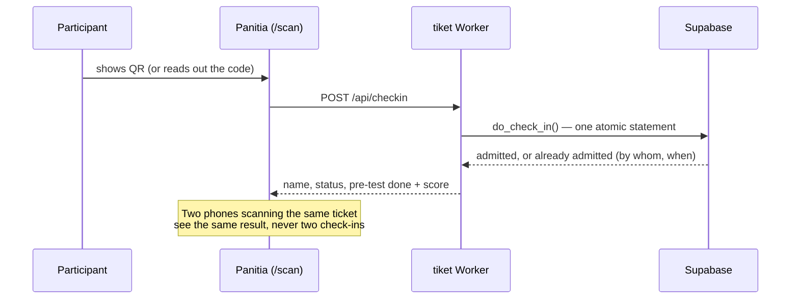
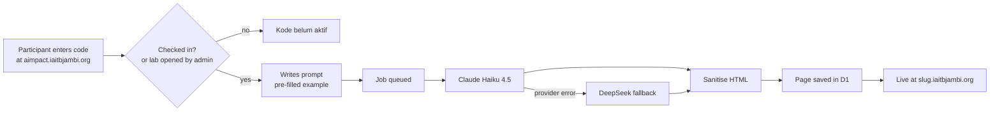

# AIMPACT Demo — Registration and AI Landing-Page Builder

The hands-on platform for **AIMPACT – AI untuk UMKM**, Kamis 17 September 2026,
Aula Griya Mayang, Jambi. Owner: IA-ITB Pengda Jambi.

A participant arrives with a phone, is checked in at the door, types a
description of their business, and leaves with a live landing page at
`<name>.iaitbjambi.org` that has a working WhatsApp order button.

**Status: live.** Both sites run on one Cloudflare Worker
([`cloudflare/`](cloudflare/)). The original AWS design and its reasoning are in
[`docs/design.md`](docs/design.md); [`terraform/`](terraform/) is that AWS
variant, kept for reference and not deployed. The staff guide, in Bahasa
Indonesia, is [`docs/Panduan-Registrasi-AIMPACT-2026.pdf`](docs/Panduan-Registrasi-AIMPACT-2026.pdf).

## Sites

| URL | What it is | Who uses it |
|---|---|---|
| `tiket.iaitbjambi.org/t/{token}` | Personal ticket: pre-test, then QR code and code | Participant |
| `tiket.iaitbjambi.org/post` | Post-test, sign in with the 6-character code | Participant |
| `tiket.iaitbjambi.org/masuk` | Staff sign-in (name from the roster + shared password) | Panitia |
| `tiket.iaitbjambi.org/scan` | Door check-in: camera QR scan or typed code | Panitia |
| `tiket.iaitbjambi.org/papan` | Attendance board: who is in, websites, pre/post scores. No codes or ticket links | Panitia |
| `tiket.iaitbjambi.org/kirim` | WhatsApp send list with a shared "sent" checklist | Panitia |
| `tiket.iaitbjambi.org/admin` | Search, cancel/restore tickets, undo check-in, admit manually, lab and post-test switches, audit log, attendance CSV | Admin |
| `aimpact.iaitbjambi.org` | The builder: enter code, write the prompt, get a page | Participant |
| `{slug}.iaitbjambi.org` | A participant's published page | Anyone |

The apex `iaitbjambi.org` is a separate site on Hostinger and is not served by
this Worker.

## One code, two doors

Every participant gets one ticket link and one 6-character code (Crockford
base32, so `O`/`0` and `I`/`1` mix-ups still work). The same code:

1. checks them in at the door — as a QR on the ticket page, or typed by staff;
2. signs them in to the builder — **but only after they have been checked in.**

The builder refuses a code that has not been scanned: *"Kode ini belum aktif.
Silakan registrasi di meja panitia terlebih dahulu."* The check fails closed —
if the ticket database cannot be reached, the builder stays shut.

## Workflow

### Before the event



- **Issuing.** `issue.mjs` reads the participant list and writes `out/`
  (git-ignored: it holds working ticket links): `tickets.json` for Supabase
  (loaded with `load-tickets.mjs`), `participants.sql` for D1 with each page
  address fixed in advance, the send list `distribusi.csv` and printable slips
  `cetak.html`. Re-running makes new codes and invalidates everything sent, so
  it refuses to overwrite `out/`.
- **Sending.** Any panitia member sends from `/kirim`; the admin copy at
  `/admin/kirim` shares the same checklist, so two people never double-send.
  The message is plain ASCII — emoji arrived as `�` on some phones.
- **Pre-test.** The ticket page shows the pre-test first and the QR after it.
  This is advisory, not a gate: the printed or typed code still works, so
  nobody is turned away at the door over a quiz. First submission wins; the
  score is calculated on the server.

### At the door



Staff see the pre-test status on the scan result and on `/papan`, and can ask
anyone who skipped it to do it on the spot.

### Building a page



- The browser submits and then polls; the page is live when the job is done.
- Each participant can generate **15 times**. A failed attempt does not count.
- The model writes a full HTML page. `src/sanitize.ts` removes scripts, frames,
  forms and event handlers, and the page is served with `script-src 'none'`
  as a backstop.
- The page address is fixed per participant and never moves to someone else.
- The queue runs 11 generations at a time, which keeps a whole-room burst under
  the Anthropic output-token rate limit.

### After the session

1. An admin opens the post-test from the switch at the bottom of `/admin`
   (closed by default, so nobody sits it during the talk).
2. Participants go to `tiket.iaitbjambi.org/post` and sign in with their code.
3. Scores appear next to the pre-test on `/papan` and `/admin/peserta`
   (for example `90 +30`).
4. `/admin/hadir.csv` exports attendance.

## When something goes wrong

| Situation | What happens / what to do |
|---|---|
| Scanner or camera fails | Type the code on `/scan`. If check-in itself is down, an admin turns on **Buka lab untuk semua** at the bottom of `/admin`: the builder accepts any valid code without check-in. A banner shows while it is on. |
| Anthropic credit runs out | Every request falls back to DeepSeek automatically. Participants see no error. Verified with all 206 accounts. |
| Anthropic and DeepSeek both unavailable | After retries the participant sees *"Gagal membuat halaman… Silakan coba lagi."* The attempt is not counted against their 15. Top up either account. |
| Wrong person admitted | Admin: **undo check-in** on `/admin`. |
| Participant replaced or cancelled | Admin cancels the ticket (the old link and code stop working, and the person drops off every list) and issues a new one. A cancelled ticket can be restored from `/admin` search. |
| Participant lost the ticket link | Admin finds them on `/admin/peserta`, which shows the ticket link and code. |

Every admin action is written to the audit log (`/admin/log`) with who did it
and why.

## Load test, 16 September 2026

All 206 accounts submitted at the same moment, once per provider.

| | **Anthropic** | **DeepSeek** |
|---|---|---|
| **Model** | Claude Haiku 4.5 (`claude-haiku-4-5-20251001`) | `deepseek-chat` |
| Pages built | 206 / 206 | 206 / 206 |
| Failed | 0 | 0 |
| First page ready | 25.4 s | 12.8 s |
| Half the pages ready by | 3 min 31 s | 2 min 21 s |
| 90% of pages ready by | 5 min 6 s | 3 min 23 s |
| Last page ready | **5.6 min** | **3.7 min** |
| Pages per minute (overall) | 37 | 56 |
| Pages finished in each minute | 4, 34, 36, 51, 54, 27 | 11, 70, 73, 52 |
| Output size per page (average / max) | 1,859 / 2,434 tokens | 2,328 / 3,490 tokens |
| **Cost for the test (billed)** | **$2.09** | **$0.59** |
| **Cost per page** | **~$0.010** | **~$0.003** |

Every Anthropic page was 3.5–7.5 KB, contained no `<script>` and had a working
`wa.me` link. A real session is gentler than this: people do not all press the
button in the same second.

## Architecture

```
tiket.iaitbjambi.org ─┐                       ┌─ Supabase Postgres (PostgREST)
aimpact.iaitbjambi.org├─ one Cloudflare Worker ┤   tickets, check_ins, audit_logs, settings
*.iaitbjambi.org ─────┘  (static assets +      ├─ D1: participants, jobs, pages
                          wildcard route)      └─ Queue (+ dead-letter) → Anthropic / DeepSeek
```

| Store | Holds |
|---|---|
| Supabase `tickets` | name, WhatsApp number, code, token **hash**, status, staff flag |
| Supabase `check_ins` | one row per ticket (primary key), so check-in cannot happen twice |
| Supabase `audit_logs` | every admin and staff action |
| Supabase `settings` | lab and post-test switches, staff roster, send checklist, one row per pre/post-test result |
| D1 `participants` / `jobs` / `pages` | builder state, generation count, published HTML |

Row-level security is forced on Supabase and nothing is granted to `anon`; the
Worker uses the service key. Sessions are HMAC-signed cookies with the role
inside the signed value (builder 12 h, staff 16 h).

## Repository

```
aiimpact-demo/
├── README.md              this file
├── docs/
│   ├── design.md          original design and decisions (section numbers are cited in code)
│   └── Panduan-Registrasi-AIMPACT-2026.pdf / panduan-registrasi.html   staff guide
├── cloudflare/            the live system — see cloudflare/README.md
│   ├── src/               Worker: index, tiket, admin, api, consumer, deepseek, sanitize, ...
│   ├── web/               builder UI
│   ├── supabase/schema.sql
│   ├── issue.mjs, load-tickets.mjs   ticket issuance
│   └── test/              vitest in the Workers runtime
└── terraform/             AWS variant, not deployed
```

## Operating

```bash
cd cloudflare
npm install
npm run check     # typecheck + tests — run before every deploy
npm run deploy
```

Secrets are set with `wrangler secret put` and never committed:
`ANTHROPIC_API_KEY`, `DEEPSEEK_API_KEY`, `SESSION_SECRET`, `SUPABASE_SERVICE_KEY`,
`STAFF_PASSWORD` and `ADMIN_PASSWORD`. Deployment details, token permissions and
the earlier burst measurements are in [`cloudflare/README.md`](cloudflare/README.md).
